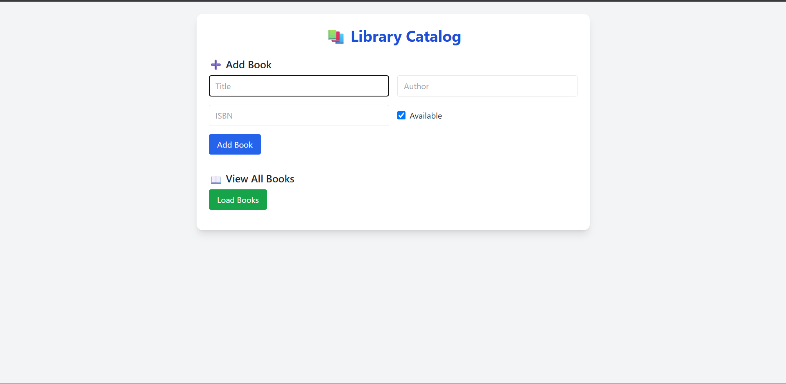
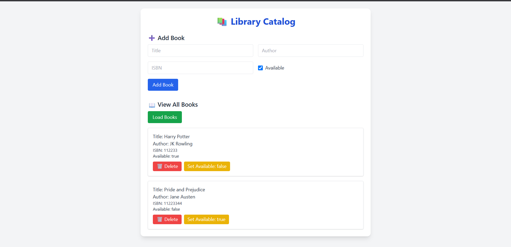

# 📚 Library Book Catalog API

This is a simple Java Spring Boot REST API for managing a library's book catalog.

---

## 🔧 Features

- Add a new book  
- Get all books 
- Get book by ID
- Delete book by ID
- Update book availability
- In-memory data store using List
- Frontend using HTML + Tailwind CSS
- Integrated form validation & alerts

---

## 🖥️ Tech Stack

- Java 17+ / 21 / 24 (depending on your environment)
- Spring Boot 3.5+
- Maven
- HTML + CSS + JavaScript (Vanilla)
- Tailwind CSS (via CDN)
- Postman (for testing)

---
### 🧱 Backend Setup (Spring Boot)

1. **Clone the repository**:
   ```bash
   git clone https://github.com/parthjs27/Library-Book-Catalog.git
   
2. **Build and run Springboot**:
    ```bash
    mvn clean install
    mvn spring-boot:run
    ```
3. **Test with Postman**:
   - Postman: [Postman Collection](https://web.postman.co/workspace/My-Workspace~9ac85c6b-578c-4853-8a90-471f7435a8a6/collection/42436012-f9e61ab9-3e0c-423e-9e24-af77aa1900b6?action=share&source=copy-link&creator=42436012)
   - Postman: [Postman Collection .json](https://drive.google.com/file/d/18jQg6EPO0cWuTE3XRFuIrAot41toGt_3/view?usp=sharing)

---
### 📁 Project Structure:
```bash
📦 library-api/
├── src/
│   └── main/
│       ├── java/com/example/library/
│       │   ├── controller/BookController.java
│       │   ├── model/Book.java
│       │   └── service/BookService.java
│       └── resources/
│           ├── application.properties
│           └── static/
│               ├── index.html
│               ├── index.js
│               └── styles.css
├── .gitignore
├── pom.xml
└── README.md
```
---
### Project Demo



---
   